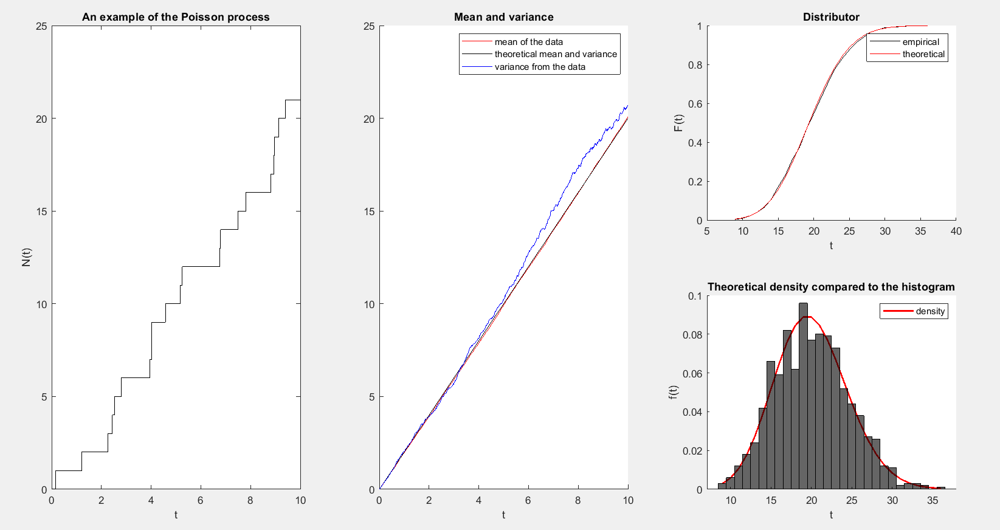

# MATLAB-programs

# [Program 1: Generating Poisson process](https://github.com/JuneMaths/MATLAB-programs/blob/main/Poisson_process.m)
The program generates...

# [Program 2: Generating Distributions](https://github.com/JuneMaths/MATLAB-programs/blob/main/Normal_distribution/Main.m)
The program generates N = 10000 realizations of the Normal distributions with three different methods (Box-Muller, Polar Coordinates, Rejection-Acceptance) with the appropriate parameters. It counts the characteristics and visually compares the theoretical and empirical distribution and distribution density.

# [Program 3: Generating Distributions](https://github.com/JuneMaths/MATLAB-programs/blob/main/Distribution_simulations.m)
The program generates N = 10000 realizations of the distributions: Expotencial(lambda), Erlang(n, lambda), Beta, Power(p) with the appropriate parameters. It counts the characteristics and visually compares the theoretical and empirical distribution and distribution density.

# [Program 4: Tangent to the circle](https://github.com/JuneMaths/MATLAB-programs/blob/main/Styczna_do_okregu_z_punktu.m)
The program draws a tangent to a circle with any given initial parameters (circle center O(x0,y0) and radius R) from any initial point P(x1,y1)

# [Program 5: Tangent plane to a three-dimensional function](https://github.com/JuneMaths/MATLAB-programs/blob/main/Plaszczyzna_funkcji.m)
The program draws tangent plane to a function of two variables passed as an anonymous function. It is the first argument of the function. The second argument is a metod of drawing the function. It can be drawn in a circle or a rectangle. The third argument is a list of necessary data for that method. The last argument is a list of point values from the function for which we want to draw a tangent plane.

